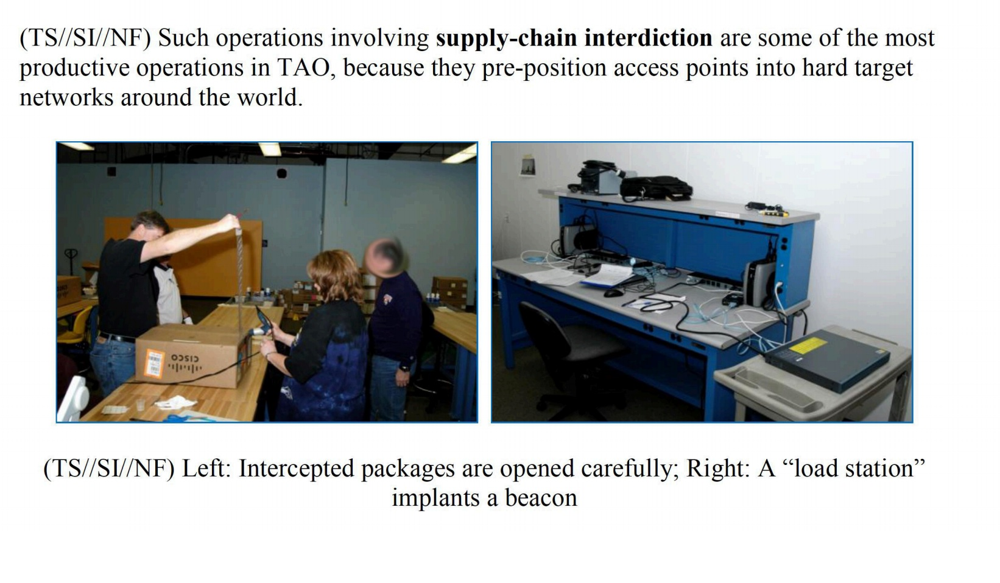
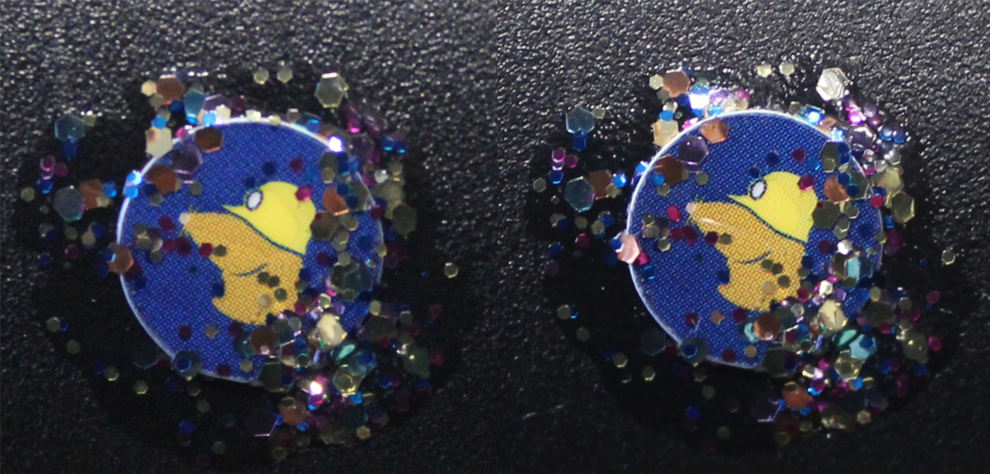
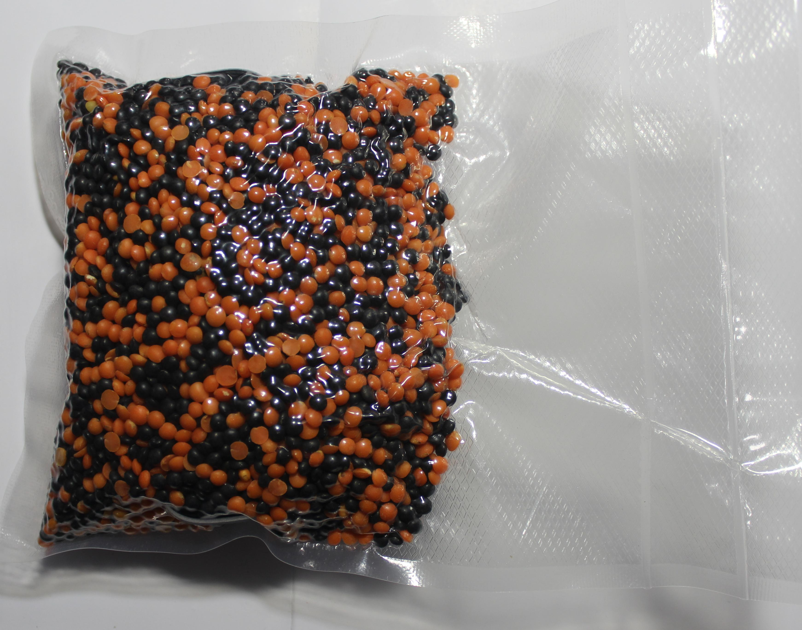
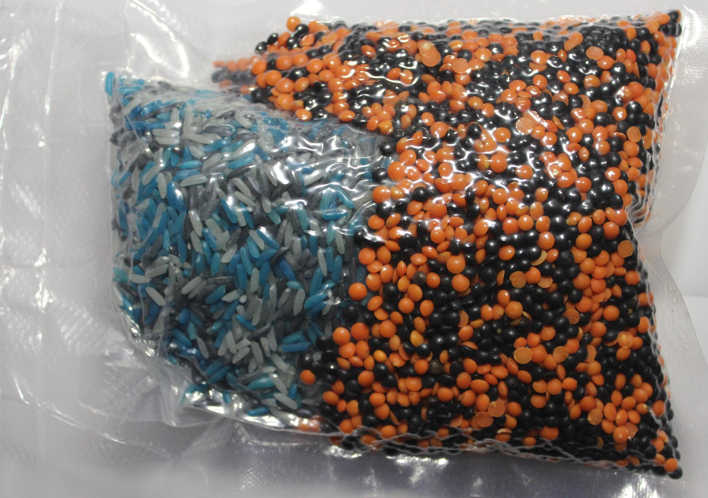
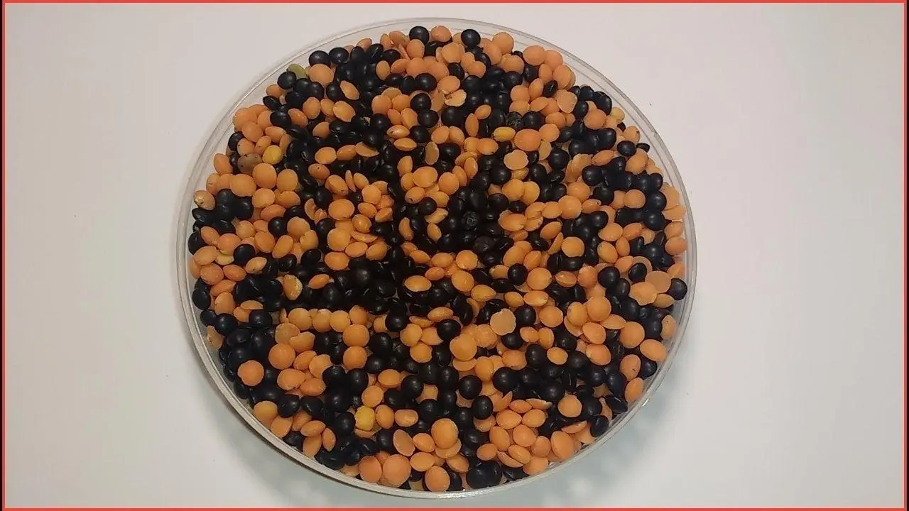

# Random Mosaic – Detecting unauthorized physical access with beans, lentils and colored rice

_December 2021_

The history of mankind is also a history of secrets, attacks and defense of the confidential. Steganography, cryptography and technical tools support us in protecting the private. The antagonists of confidentiality operate - depending on the actor - outside or inside legal frameworks, often adapting them with bogus arguments.

If we have objects or devices outside our view, we cannot rule out that there was unwanted/unauthorized access to them and the confidentiality and integrity possibly no longer exists. If there has been an unauthorized access (attempt), it is in the interest of the affected parties (owner/proprietor/transmitter/receiver) to know about it in order to initiate any follow-up measures and not to think themselves in a false sense of security.

For thousands of years, seals have been used in various forms with the goal of certifying the confidentiality and integrity of letters, for example. Attacks on these protective measures are similarly old. This continues to this day, but these attacks are now taking place on a very different level. A lot has changed since then, especially due to digital communication and the widespread presence of technical devices, as well as the accumulation and automated analysis of data. Modern communication tools reach very deeply into our lives, so their confidentiality and integrity should also be a very high priority.

Below we show a few examples of these attacks, summarize known countermeasures and introduce a new method.

## Table of contents

<nav>
  <ul>
    <li>
      <a href="#ein-und-angriffe">Intrusions and attacks</a>
      <ul>
        <li>
          <a href="#manipulation-auf-dem-versandweg">Tampering in transit (supply chain interdiction)</a>
        </li>
        <li>
          <a href="#evil-maid-attacken">Evil Maid attacks</a>
        </li>
      </ul>
    <li>
      <a href="#schutzverfahren">Protection methods</a>
    </li>
    </li>
      <ul>
        <li>
          <a href="#glitzer-nagellack">Glitter nail polish</a>
          <ul>
            <li>
              <a href="#glitzer-nagellack-mit-aufklebern">Glitter nail polish with stickers</a>
            </li>
            <li>
              <a href="#glitzer-nagellack-direkt">Glitter nail polish directly</a>
            </li>
            <li>
              <a href="#glitzer-nagellack-mit-klebstoff">Glitter Nail Polish with Adhesive</a>
            </li>
            <li>
              <a href="#fazit">Conclusion</a>
            </li>
        </ul>
        </li>
       </ul>
    <li>
      <a href="#random-mosaic-rm">random mosaic $ rm -r ice</a>
    </li>
      <ul>
        <li>
          <a href="#auf-der-suche-nach-geeigneten-substanzen">In search of suitable substances</a>
          <ul>
            <li>
              <a href="#rote-linsen-und-belugalinsen">Red lentils & Beluga lentils</a>
            </li>
            <li>
              <a href="#gelbe-erbsen-und-weiße-bohnen">Yellow peas & white beans</a>
            </li>
            <li>
              <a href="#gefaerbter-reis">Colored rice</a>
            </li>
            <li>
              <a href="#goldhirse">Golden millet</a>
            </li>
            <li>
              <a href="#vogelfutter">Birdseed</a>
            </li>
            <li>
              <a href="#kugeln-aus-verschiedenen-farben-groessen-und-materialien">Spheres of different colors, sizes and materials</a>
            </li>
            <li>
              <a href="#gefaerbtes-salz">Colored salt</a>
            </li>
            <li>
              <a href="#gefaerbter-zucker">Colored sugar</a>
            </li>
            <li>
              <a href="#gefaerbte-maisstärke">Colored Cornstarch (DIY Holi Powder)</a>
            </li>
            <li>
              <a href="#kinetischer-sand">Kinetic sand</a>
            </li>
          </ul>
        </li>
        <li>
          <a href="#faerben-mit-lebensmittelfarbe">Coloring with food coloring</a>
         </li>
        <li>
          <a href="#kurzzeitige-lagerung">Short-term storage</a>
         </li>
        <li>
          <a href="#laengerfristige-lagerung-oder-versand">Longer-term storage or shipping</a>
         </li>
          <ul>
            <li>
              <a href="#vakuumieren-mit-dem-staubsauger">Vacuuming with a vacuum cleaner</a>
            </li>
            <li>
              <a href="#vakuumieren-mit-einem-vakuumiergeraet">Vacuuming with a vacuum sealer</a>
            </li>
            <li>
              <a href="#kaskadierung">Cascading</a>
            </li>
          </ul>
        </li>
        <li>
          <a href="#auswertung">Evaluation</a>
         </li>
          <ul>
            <li>
              <a href="#blink-comparison">Blink Comparison</a>
            </li>
          </ul>
      </ul>
    <li>
      <a href="#danksagung-und-partizipation">Acknowledgements and participation</a>
    </li>
    <li>
      <a href="#erwaehnungen">References</a>
    </li>
  </ul>
</nav>

<h2 id="ein-und-angriffe">Intrusions and attacks</h2>

<h3 id="manipulation-auf-dem-versandweg">Tampering in transit (supply chain interdiction)</h3>

While the U.S. government has claimed for years that Chinese companies are building surveillance technology into devices exported to the U.S. (such as networking equipment), it was revealed in 2014 in the book ["Global Surveillance" by Glenn Greenwald](https://www.droemer-knaur.de/buch/glenn-greenwald-die-globale-ueberwachung-9783426786918) that the NSA's "TAO" (Tailored Access Operations) unit has been intercepting and tampering with technical devices in transit since at least 2010. [Netzpolitik.org](https://netzpolitik.org/2014/nsa-hat-eine-spezialeinheit-um-paeckchen-zu-oeffnen-und-wanzen-zu-implantieren/) summarizes:

> According to them, it is common practice to, among other things, prepare servers, routers, and other network technology with
> eavesdropping technology before exporting them to third countries. The equipment is then repackaged and shipped as planned.

It is likely that such attacks are taking place in other states as well - whether against individuals or on a larger scale. [The Intercept published a good article](https://theintercept.com/2019/01/24/computer-supply-chain-attacks/) on supply chain attacks in 2019, Microsoft started its own series of articles that same year: [Part 1](https://web.archive.org/web/20201029013253/https://www.microsoft.com/security/blog/2019/10/16/guarding-against-supply-chain-attacks-part-1-big-picture/), [Part 2](https://web.archive.org/web/20210226030901/https://www.microsoft.com/security/blog/2020/02/03/guarding-against-supply-chain-attacks-part-2-hardware-risks/), and [Part 3](https://web.archive.org/web/20210303150737/https://www.microsoft.com/security/blog/2020/03/11/guarding-against-supply-chain-attacks-part-3-how-software-becomes-compromised/).

<h3 id="evil-maid-attacken">Evil Maid attacks</h3>

If somebody has hardware access, an [Evil Maid attack](https://www.whonix.org/wiki/AEM) can be carried out [within a few minutes](https://www.youtube.com/watch?v=loBX_vEXxVA). Whoever has access to the hardware can not only manipulate firmware and possibly software, but also replace or manipulate hardware and create images of storage media.

The linked article also presents measures that should at least allow such manipulation to be detected. Because not all accesses are as obvious as here:

> I just write quicker sometimes with pen and paper. I put it in the safe in my hotel room, and that night I had gone out by myself. I came home and the door to my hotel room was open, the safe was open, there was still the cash I had taken out from the Cueva sitting on a table, so no one had stolen anything. When I first saw the door open I thought oh, maybe they’re doing late turndown service or something, but the door to the safe was open with my laptop in it and my laptop was in a different position. I don’t know what happened, you know? Someone clearly opened the safe, they moved it around, they didn’t take any money, but they also left my door open. So, I never knew whether they actually did something or put something on the laptop or looked at the laptop and saw that there was nothing there, or whether they just left it open to scare me or send a message.
>
> – [Nicole Perlroth (cyber-security and digital espionage reporter at The New York Times) at 16:45 in EP 98: Zero Day Brokers from darknet diaries.](https://darknetdiaries.com/transcript/98/)

<h2 id="schutzverfahren">Protection methods</h2>

There are special screws, seals, "tamper-proof" labels and tape, "tamper-proof" bags, and [much more](https://www.hhi.fraunhofer.de/abteilungen/fs/projekte/archiv/optical-tamper-protection-otp-fuer-prs-security-module.html) to detect unauthorized access to items or to the contents of shipments, for example. We assume that most of the methods can be broken and are not a problem for talented and resourceful attackers. If you want to get an insight, you can have a look at presentations like the one from [DEFCON 19: Introduction to Tamper Evident Devices](https://www.youtube.com/watch?v=W07ZpEv9Sog). You can also learn more about this in the work of Sergei Skorobogatov (Physical Attacks and Tamper Resistance. Introduction to Hardware Security and Trust, 143-173, `doi:10.1007/978-1-4419-8080-9_7`) and [Elena Dubrova](https://people.kth.se/~msmith/is2500_pdf/Anti-Tamper%20Techniques_elena.pdf). There are also competitions to get around as many of these protections as possible. For example, Mos & Boo give us insights from the [OzSecCon 2018 Tamper Evident Challenge](https://mosandboo.com/ozseccon-2018-tamper-evident-challenge-walkthrough/).

Some companies deliberately avoid certain tamper-evident procedures. [For example, Ledger](https://support.ledger.com/hc/en-us/articles/4404389367057-Is-my-Ledger-device-genuine-?#h_d3e66427-a745-46c6-b1bf-3b7f52ba8ed4), the manufacturer of the eponymous hardware wallet for cryptocurrencies, refers to the forgeability of seals and limits itself to [hardware-side protection measures](https://support.ledger.com/hc/en-us/articles/4404382029329-Check-hardware-integrity):

> **Anti-tamper seals**
>
> Ledger deliberately chooses not to use anti-tamper seals on its packaging. These seals are easy to counterfeit and can,
> therefore, be misleading. Rather, genuine Ledger devices contain a secure chip that prevents physical tampering: this
> provides stronger security than any sticker possibly could.

After a leak in 2020, several Ledger customers received [tampered purported replacement devices](https://www.nasdaq.com/articles/inside-the-scam%3A-victims-of-ledger-hack-are-receiving-fake-hardware-wallets-2021-06-17) by mail in spring 2021.

Other companies are looking for ways to improve. For example, after our experiments, we found [the work of shiftcrypto](https://shiftpages.github.io/tamper-evident-packaging/#how-it-works) and were pleased to see that they were taking similar approaches in some cases. You can read more about their experiences during the testing phase [in this review](https://medium.com/shiftcrypto/bitboxtep-alpha-program-what-we-have-learned-cd2e1a1bbd6c).

<h3 id="glitzer-nagellack">Glitter nail polish</h3>

A realtively widespread method to seal screws on devices, for example, so that unauthorized access is more likely to be detected, is the use of nail polish with varicolored and differently-sized elements. To our knowledge, this technique was first presented at [30C3](https://media.ccc.de/v/30C3_-_5600_-_en_-_saal_1_-_201312301245_-_thwarting_evil_maid_attacks_-_eric_michaud_-_ryan_lackey) by [Eric Michaud](https://twitter.com/ericmichaud) and [Ryan Lackey](https://twitter.com/octal) and is recommended and used by several companies and individuals, including [journalists evaluating the Panama Papers](https://www.mz.de/deutschland-und-welt/politik/panama-papers-journalisten-sicherten-laptops-mit-glitzernagellack-1138070).

We have done a few experiments on our own to test the effectiveness of this process.

<h4 id="glitzer-nagellack-mit-aufklebern">Glitter nail polish with stickers</h4>

In the method described by [Mullvad VPN](https://mullvad.net/en/help/how-tamper-protect-laptop/), a sticker whose edge is sealed with [glitter nail polish](https://shop.proxysto.re/conf/501) protects the screws (or unused ports) so that, on the one hand, access attempts can be detected and, on the other hand, access to them can be regained easily if necessary. With this procedure, however, attackers without a lot of practice can use a needle or scalpel, for example, to drive under the sticker and push it partially upward to get to the screws relatively easily. The broken areas in the paint could be repaired with clear nail polish, although we did not need to do this in most of our tests. We have used two different stickers in our experiments so far, with the Mullvad one holding up best.

The picture below is a pre-post-comparison of one of our first attempts. Except for 3-4 glitter elements at the top left edge of the sticker, all others are still in the same place. This could be further reduced in subsequent attempts, so we rate this method as only partially suitable.

The left image shows a screw sealed with Mullvad VPN nail polish. The right image was taken after this sealant was opened once as described above. In the upper left part of the right image, you can see that the arrangement of the elements at the edge of the sticker has changed a bit. The two larger elements (left edge in the middle and at the bottom) were also broken, but have been moved to their old position afterwards. In further tests we achieved similar results. The relevant factor in this process is the amount of elements on the edge of the sticker. In addition, there are special seal stickers available which break when peeled off. They are probably more suitable for this method.

<h4 id="glitzer-nagellack-direkt">Glitter nail polish directly</h4>

This method is used by [Nitrokey](https://docs.nitrokey.com/de/nitropad/qubes/sealed-hardware.html), [Purism](https://puri.sm/posts/anti-interdiction-update-six-month-retrospective/) and others, and is safer compared to the previous method in our view. The screws are sealed directly with glitter nail polish. The screws holes are particularly relevant here. If they are too deep, it is difficult to take a suitable photo of the seal under normal conditions. If the hole is shallow or if it is completely filled with nail polish, there is a risk that if a lot of polish is used, the top layer can be cut off and reapplied after manipulation with clear polish. If the nail polish contains too few elements, they could be manually arranged back to the original location after manipulation if necessary. Unfortunately, we currently do not know how [HoodiePony](https://twitter.com/hoodiePony) proceeded to successfully break and reattach three of four seals at the _OzSecCon 2018 Tamper Evident Challenge_.

<h4 id="glitzer-nagellack-mit-klebstoff">Glitter Nail Polish with Adhesive</h4>

We tried combining glitter nail polish with various adhesives (UHU all-purpose glue, Herlitz superglue, Doratex Double Power, Yachtcare Super Epoxy) in further trials. These methods make it harder to undo screws when needed. Our favorite so far is sealing screws with epoxy resin and glitter nail polish, where the polish can be in or over the resin.

<h4 id="fazit">Conclusion</h4>

With the first two methods, it is sometimes very difficult or even impossible to detect manipulations. However, a thorough approach can increase the chances. Attacks on adhesives, for example with solvents or heat, still need to be investigated in more detail.

<h2 id="random-mosaic-rm">random mosaic $ rm -r ice</h2>

An alternative to sealing is embedding the whole object in a substance whose surface forms a mosaic that is difficult to reproduce and changes when manipulated. It should be as easy as possible to check the mosaic manually or by technical means. The goal is to protect written documents, data carriers, communication devices, hardware wallets and other sensitive objects in such a way that unauthorized access can be detected with greater probability. We distinguish between two use cases: short-term storage and longer-term storage or shipping.

<h3 id="auf-der-suche-nach-geeigneten-substanzen">In search of suitable substances</h3>

The sought mixture should:

- be not too fine-grained, so that the individual elements can be easily identified
- not be too coarse, so that it is as difficult as possible to reproduce the mosaic
- be composed of elements of different colors and/or sizes, in order to obtain a mosaic as rich in contrast as possible
- consist of elements that are as round as possible in order not to jam
- be as dry as possible and not tend to form lumps or stick together
- be simple and inexpensive to obtain
- be solid so as not to cause damage in the event of leakage
- have no sharp edges or pointed corners that could cause damage
- not be too heavy, e.g. to save shipping costs

To test the mixing behavior, the first three points in particular were relevant for us. We examined several substances, limiting ourselves to those that met the last three points of our requirements. Our favorites so far are: Red lentils & Beluga lentils, yellow and green peas and white beans, and colored rice.

<h4 id="rote-linsen-und-belugalinsen">Red lentils & Beluga lentils</h4>

The lentils have good size, good mixing behavior and form a high contrast mosaic.

<h4 id="gelbe-erbsen-und-weiße-bohnen">Yellow peas & white beans</h4>

Both the yellow peas and white beans are a good size, mix well and create a high-contrast mosaic.

<h4 id="gefaerbter-reis">Colored rice</h4>

The rice is a little more fine-grained than the two previously mentioned substances. However, it has the advantage that you can compose your own desired colors with food coloring (more on this below).

<h4 id="goldhirse">Golden millet</h4>

We tested millet only in combination with other substances due to its small size.

<h4 id="vogelfutter">Birdseed</h4>

Birdseed has the advantage of looking relatively normal in smaller bags, which may allow it to hide its secret from attackers. However, depending on its composition, it can stick.

<h4 id="kugeln-aus-verschiedenen-farben-groessen-und-materialien">Spheres of different colors, sizes and materials</h4>

The spheres probably have the best resistance compared to the other items, but are more expensive and harder to get than most of the other subtances.

<h4 id="gefaerbtes-salz">Colored salt</h4>

We colored the salt with food coloring (more on this below). Because of the grain size, it is harder to compare the mosaic.

<h4 id="gefaerbter-zucker">Colored sugar</h4>

We colored the sugar with food coloring (more on this below). Sugar behaves similarly to salt, but there is occasional slight lumping. Because of the grain size, it is harder to compare the mosaic.

<h4 id="gefaerbte-maisstärke">Colored Cornstarch (DIY Holi Powder)</h4>

We colored the cornstarch with food coloring (more on that below). It makes a powder mixture where the individual colors are sometimes hard to see.

<h4 id="kinetischer-sand">Kinetic sand</h4>

We consider kinetic sand (also called modeling sand) to be impractical. It is relatively costly, unsuitable in a single color, and after mixing multiple colors several times everything looks the same, so that it is no longer possible to determine whether there was an attempted access or not.

<h3 id="faerben-mit-lebensmittelfarbe">Coloring with food coloring</h3>

We tested two different food colorings. We find the colors from _V2 Foods_ better than those from _Limino_ because of the higher color intensity. The procedure was always similar:

1. Add about 15 drops of food coloring to 125 g of substance.
2. Add half a teaspoon of water (except for salt and sugar).
3. Mix well in a closed bag or box.
4. If the desired color intensity is not yet achieved, add a few more drops of food coloring. Not too much, otherwise the substance may stick or clump together.
5. Spread the colored substance on a plate, on baking paper or in a box and let it air dry.

Following another guide, we first used vinegar essence instead of water. However, the colored rice became very smelly with it, so we decided to use only water. The result was similar in both cases. Before the vessel is used for dyeing with another color, it should be cleaned well so that color residues do not affect the result.

So far, we cannot assess the durability of the color over a longer period of time. It is possible that UV radiation and other influences will cause the color intensity to fade.

In addition to normal food coloring, parts of the substance could also be colored with fluorescent black light dyes. Thus, in addition to the normal and obvious image, there would be another mosaic that is only visible with black light. We have not tested this yet.

<h3 id="kurzzeitige-lagerung">Short-term storage</h3>

Following the history of its development, let's start with the first application, short-term storage. When we need to leave a place and leave items or equipment behind, we can store them in a box that is transparent from all sides. Then we fill the box with our colorful mixture so that our devices are covered. The box should be stored in such a way that shocks or other factors do not change the mosaic. For example, the box can be positioned on a towel or piece of clothing on an object in such a way that this attenuates minor vibrations of the environment, but the box cannot slide off it.

For an overall comparison, we can photograph the box from all visible sides and store these photos on a device that is as secure as possible, send it to a trusted person via an encrypted and verified channel, or send it to another device of our own. The next step is to compare the found mosaic with the original one. The app [Blink Comparison](https://github.com/proninyaroslav/blink-comparison), which we will discuss below, is ideal for this purpose.

To protect an object from damage, e.g., by staining or by the substance leaking into, say, the ports of a laptop, it can be wrapped in cling film, a bag, or otherwise.

A combination with [Haven](https://guardianproject.github.io/haven/) as an additional security layer may be recommended at this point.

<h3 id="laengerfristige-lagerung-oder-versand">Longer-term storage or shipping</h3>

Especially when shipping sensitive items, we see the need to be able to detect unauthorized access. Almost every shipping method involves people and locations unknown to us.

Since the colored elements in the above proposal would not hold their position during transport, we change the procedure. Our object now goes into an air-impermeable wrapping. This is filled with our colored substance so that the object is covered from all sides as far as possible, and is then vacuumed. This holds the colored substance in place. If the wrapping is damaged and pressure equalization takes place, but at the latest when the enclosed object is accessed, the elements change their position.

<h4 id="vakuumieren-mit-dem-staubsauger">Vacuuming with a vacuum cleaner</h4>

Since many people own vacuum cleaners and there are also public vacuum cleaners at gas stations, this method is our first priority. There are special reusable vacuum bags to store e.g. clothes and blankets in a space-saving and protected way. The air from the bag is removed with a vacuum cleaner or a hand pump through a valve. Commercially available bags are quite large, so they are well suited for laptops, for example, but less suited for small objects.

<h4 id="vakuumieren-mit-einem-vakuumiergeraet">Vacuuming with a vacuum sealer</h4>

There are many different vacuum sealer machines, which differ in quality and size. They are used, for example, to keep food fresh for longer. Suitable bags are available in many sizes, but they cannot be reused easily or only with loss of material.

<h4 id="kaskadierung">Cascading</h4>

In both methods, the bags containing the elements can also be cascaded. To do this, after photographing the result of the first process, it is placed in another bag with additional substance and vacuumed again.

<h3 id="auswertung">Evaluation</h3>

If of one or more elements within the mosaic are modified, unauthorized access or compromise can be assumed. The assessment should be made depending on the situation and the individual need for protection. It may just be that one's pet or family member was a bit curious about what the colorful mixture was all about, or a bag was leaking.

<h4 id="blink-comparison">Blink Comparison</h4>

With apps like [Blink Comparison](https://github.com/proninyaroslav/blink-comparison), it is easy to compare an original photo, which has been taken for example, by a manufacturer, signed and transmitted to a customer via an encrypted communication channel, with a photo of the current state. The app helps one take the comparison photo from the same angle and distance as the original photo.

Blink Comparison then switches between the two images when the screen is touched, making direct comparison much easier. This is shown in the following animated graphic. The photo outlined in red is the original photo. Before taking the comparison photo, a black lentil in the lower left area has been removed, thereby moving another lentil a little bit. The change of the pattern between the original photo and the comparison photo can be seen fast and easily.

<h2 id="danksagung-und-partizipation">Acknowledgements and participation</h2>

We would like to take this opportunity to thank everyone who helped us with this project. Thanks go especially to those who provided us with vacuum sealing equipment, Mullvad VPN for the glitter nail polish, Nitrokey and Purism for the exchange on sealing with nail polish, and [Insurgo](https://insurgo.ca) for the tip about Blink Comparison.

If you have any further ideas, hints or suggestions for improvement, please [feel free to write us](https://proxysto.re/contact.html) or collaborate with us on [github](https://github.com/dys2p/website-dys2p/blob/master/2021-12-tamper-evident-protection) on this project.

<h2 id="erwaehnungen">References</h2>

* [anarsec.guide - Make Your Electronics Tamper-Evident](https://www.anarsec.guide/posts/tamper/)
* [c't 16/2022](https://www.heise.de/select/ct/2022/16), S. 44
* [Hacker News - Detecting unauthorized physical access with beans, lentils and colored rice (2021) (dys2p.com)](https://news.ycombinator.com/item?id=31897530)
* [heise.de - Random Mosaic: Fremdzugriffe mit Bohnen, Linsen oder buntem Reis erkennen ](https://web.archive.org/web/20220627170123/https://www.heise.de/news/Random-Mosaic-Fremdzugriffe-mit-Bohnen-Linsen-oder-buntem-Reis-erkennen-7155080.html)
* [Tokimarks - Tamper-evident Ballot Boxes](https://github.com/mleonhard/tokimark#tamper-evident-ballot-boxes)
* [UNREDACTED Magazine - The Privacy, Security, & OSINT Magazine Issue 004](https://unredactedmagazine.com/issues/004.pdf)
* [Yahoo Finanzen - Linsen, Bohnen und Glitzernagellack: Wie man Ware beim Versand vor Fremdzugriff schützt](https://de.nachrichten.yahoo.com/linsen-bohnen-und-glitzernagellack-wie-man-ware-beim-versand-vor-fremdzugriff-schutzt-121805730.html)
